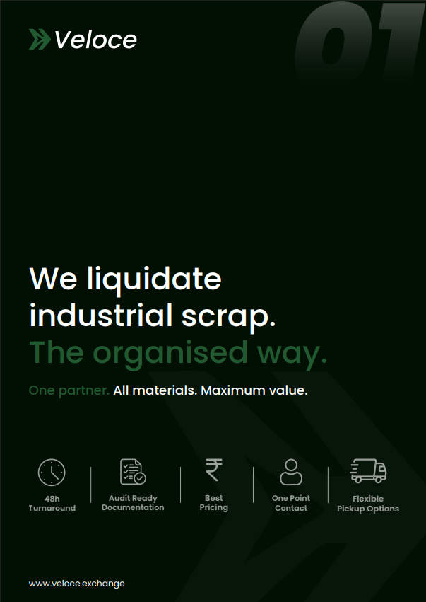
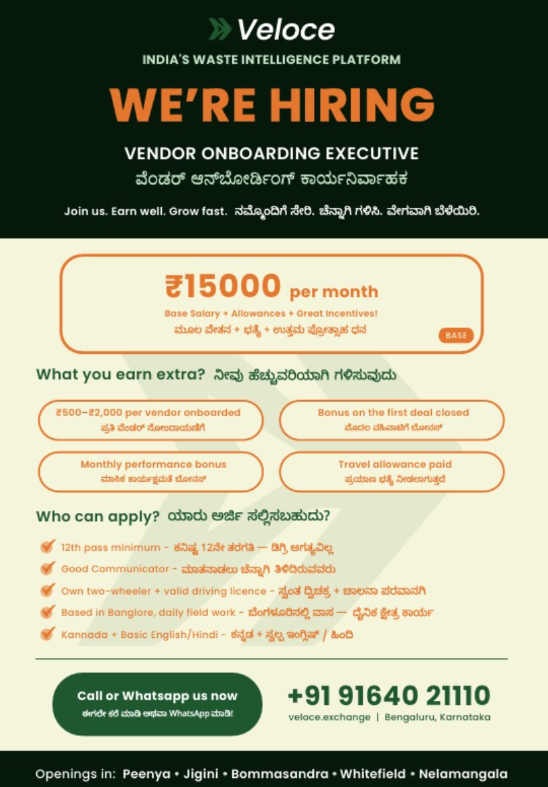
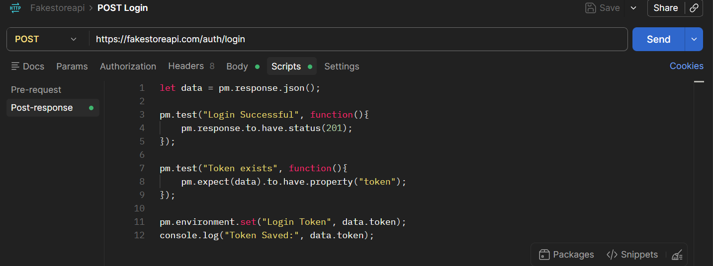
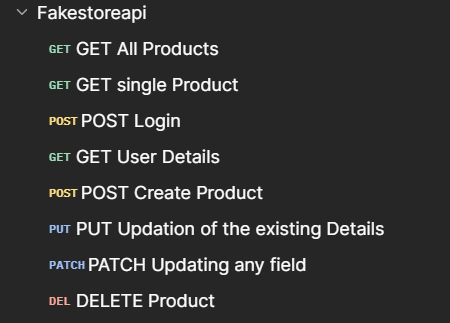
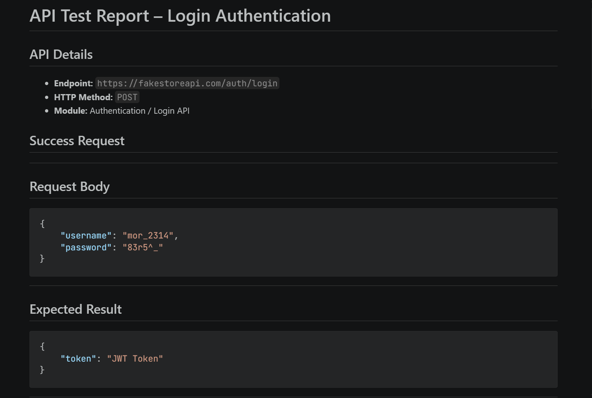

# Weekly Log — Week [1] | [25/05/2026 - 30/05/2026]
**Name:** M Suhas Karthikeya  
**Role:** SDE-I — Crita Creative  
**Reporting Manger:** Sabariram S R

---

## ✅ Summary
This week, I focused on both design and development tasks. On the design front, I worked on creating an AL brochure using Adobe Illustrator and desgined a vendor onboarding poster for Veloce. Alongside this, I completed a structured study plan covering QA and API testing concepts, which has helped build a stronger foundation for professional development. By the end of the week, I also transitioned into active project work, beginning contributions to a real-world project.

---

## 📋 Tasks Completed

> ### 📅 Date: 25/05/2026 (MONDAY)

#### 1. Veloce Asset Liquidation Brochure Design.
- **What I did:**  Designed a professional brochure for AL using Adobe Illustrator, focusing on layout composition, typography, and brand-consistent visual elements to effectively communicate the intended message.
- **Tools used:** Adobe Illustrator, Flaticon.
- **Status:** 🔄 In Progress

**Proof:**  

#### 2. Veloce Vendor Onboarding Poster Design.
- **What I did:**  Desinged a vendor hiring poster with all the information sent by the client.
- **Tools used:** Adobe Illustrator, Flaticon.
- **Status:** 🔄 In Progress

---

> ### 📅 Date: 26/05/2026 (TUESDAY)

#### 1. Veloce Vendor Onboarding Poster Design.
- **What I did:**  Desinged a vendor hiring poster with all the information sent by the client.
- **Tools used:** Adobe Illustrator, Flaticon.
- **Status:** ✅ Done

**Proof:**  

#### 2. Phase-I Learning (Javascripts Basics)
- **What I did:**  Learnt basics in JS like let, const, var and datatypes.
- **Tools used:** YouTube, Chrome, Claude
- **Status:** ✅ Done

---

---

> ### 📅 Date: 27/05/2026 (WEDNESDAY)

#### 1. Veloce Asset Liquidation Brochure Design.
- **What I did:**  Changes and rework on design is done as per the client's request.
- **Tools used:** Adobe Illustrator, Flaticon.
- **Status:** ✅ Done

#### 2. Phase-II Learning (JS related to Postman)
- **What I did:**  Used JS to write scripts in Postman.
- **Tools used:** Postman, Claude
- **Status:** ✅ Done

**Proof:**  

---

> ### 📅 Date: 28/05/2026 (THRUSDAY)

#### 1. Veloce Vendor Onboarding Design.
- **What I did:**  Changes of illustrations and colors done, as per clients requirement.
- **Tools used:** Adobe Illustrator, Flaticon.
- **Status:** ✅ Done

#### 2. Phase-II Learning (Postman Collection)
- **What I did:**  Written scripts for all HTTP Methods and fire the testing for entire collection.
- **Tools used:** Postman, Claude
- **Status:** ✅ Done

**Proof:**  

---

> ### 📅 Date: 29/05/2026 (FRIDAY)

#### 1. Phase-III Learning (Using JMeter for Performance Testing)
- **What I did:** Installed and setup the JMeter, learnt how to use it.
- **Tools used:** JMeter
- **Status:** ✅ Done

#### 2. Revision of Learning (Phase 1, 2, 3)
- **What I did:** Revisied every step clearly and made ready for real project.
- **Tools used:** Postman, JMeter
- **Status:** ✅ Done

#### 2. Learnt How to make a Testing Report.
- **What I did:** With the guidance of Sabari sir, learned how to create a test report.
- **Tools used:** Postman, VS code, Claude
- **Status:** ✅ Done

**Proof:**  

---

> ### 📅 Date: 30/05/2026 (SATURDAY)

#### 1. Start Testing with Real Project (Veloce)
- **What I did:** Got the API documentation from Vijay for testing, starting with auth module. Imported the collections
- **Tools used:** Postman, JMeter, VS code, Github, Claude
- **Status:** 🔄 In Progress

## 🧠 What I Learned
- Learnt JavaScript fundamentals including `let`, `const`, `var`, and core data types.
- Wrote and executed JavaScript test scripts in Postman for various HTTP methods.
- Ran automated tests across an entire Postman collection using pre/post scripts.
- Set up and explored Apache JMeter for performance and load testing.
- Learnt how to structure and generate a professional API test report.

---

## 🚧 Blockers / Challenges
- Encountered an unexpected crash with Adobe Illustrator, which prevented the design file from being exported. Troubleshooting the issue consumed a significant portion of the day, causing a delay in testing task completion.

---

## 📅 Plan for Next Week

| Priority | Task | Status |
|----------|------|--------|
| 🔴 High | Complete testing of the Veloce Auth Module and document results in a structured test report. | ⏳ Pending |
| 🔴 High | Continue testing additional modules from the Veloce API documentation. | ⏳ Pending |

---

## 📎 References / Resources Used

- [Adobe Illustrator](https://www.adobe.com/in/products/illustrator.html) — Used for brochure and poster design.
- [Flaticon](https://www.flaticon.com) — Used for icons and illustrations in design tasks.
- [JavaScript Basics — YouTube](https://www.youtube.com) — Referred for learning JS fundamentals.
- [Postman Learning Center](https://learning.postman.com) — Referenced for writing test scripts and collection testing.
- [Apache JMeter Documentation](https://jmeter.apache.org/usermanual/index.html) — Referred for JMeter setup and performance testing.
- [Veloce API Documentation](https://github.com/crita-creative-dev/veloce-exchange-be-insomnia-collections) — Provided by Vijay, used for real project testing.